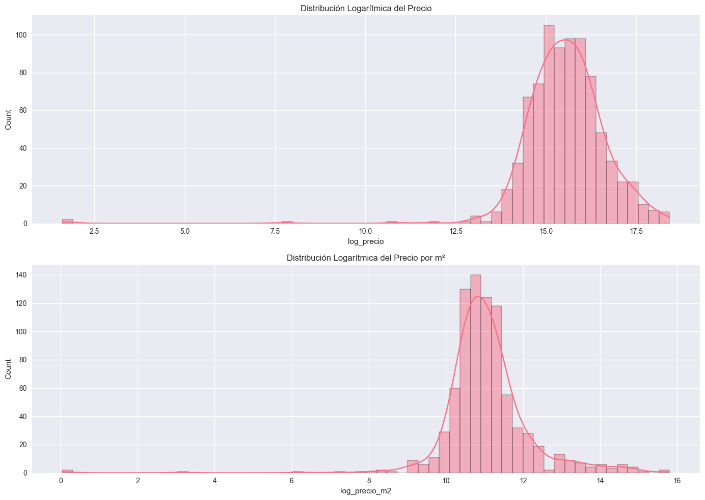
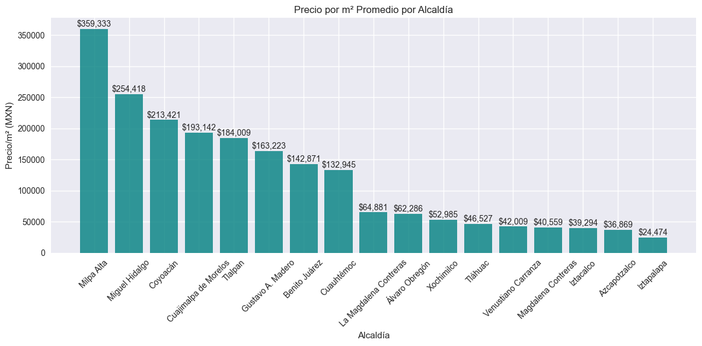
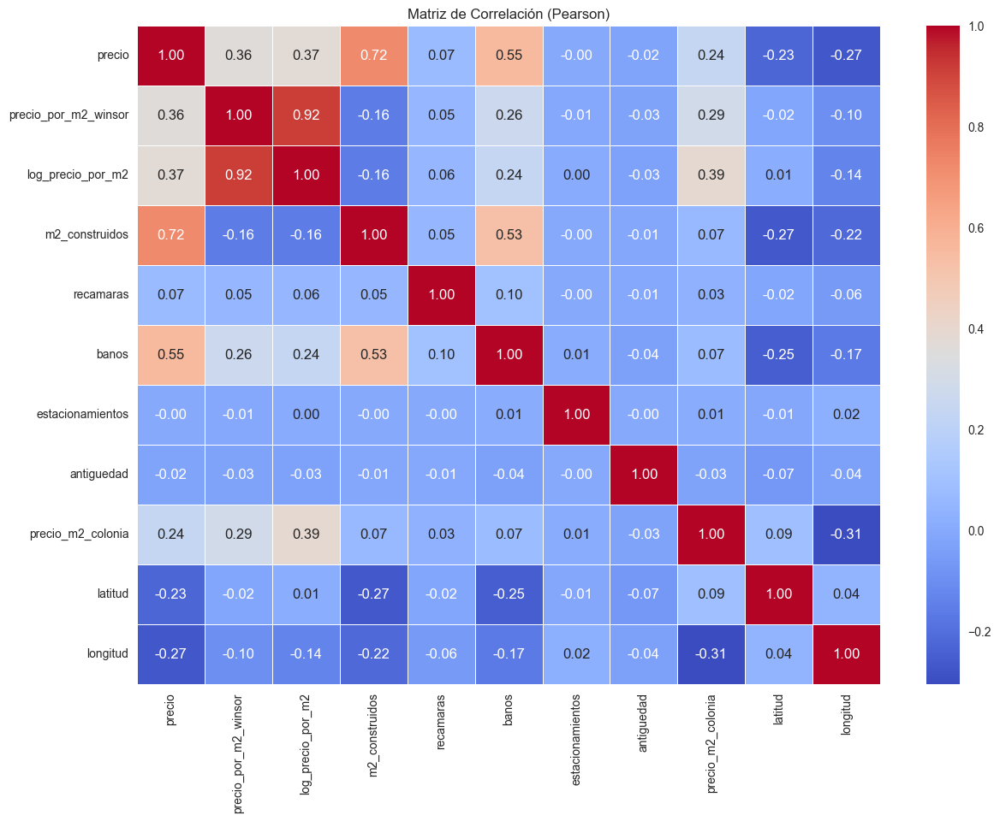
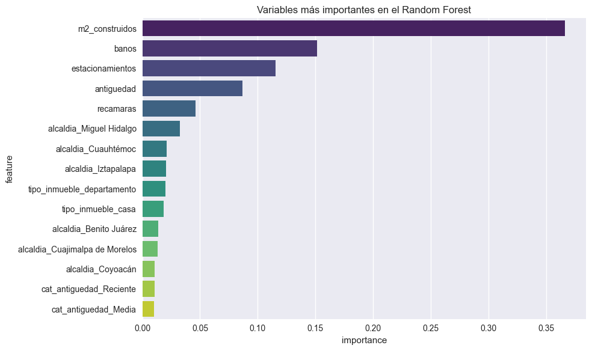

# propiedades-cdmx

[](https://github.com/TU_USUARIO/propiedades-cdmx/actions/workflows/ci.yml)
[](LICENSE)
[](pyproject.toml)

Scraper de propiedades en venta en CDMX (propiedades.com) más el análisis que hice sobre los datos: EDA, regresión lineal, simulación Monte Carlo, Random Forest, clustering de colonias y una red neuronal, comparando los tres modelos con métricas reales fuera de muestra en vez de quedarme solo con el que se ve mejor.

(Cambia `TU_USUARIO` por tu usuario de GitHub en el badge de arriba cuando subas el repo.)

## Resultados

Precio y precio/m² están muy sesgados a la derecha, así que trabajé en escala logarítmica el resto del análisis:



Precio/m² promedio por alcaldía — Miguel Hidalgo, Coyoacán y Cuajimalpa arriba, consistente con lo que uno esperaría del mercado real:



Ojo con Milpa Alta: sale más cara que Miguel Hidalgo en la gráfica porque solo hay 8 propiedades capturadas ahí, no porque el mercado sea así. Lo dejo tal cual porque es justo el tipo de error que hay que aprender a detectar antes de confiar en un promedio agrupado.

Correlación entre variables — `m2_construidos` (0.72) y `baños` (0.55) son las que más pesan sobre el precio:



Y lo que más le importa al Random Forest — tamaño construido, baños y estacionamientos, por encima de las variables de ubicación:



### Comparación de modelos (predicción de log-precio/m²)

| Modelo                      | R² train | R² test | MAE test (log) |
| :--------------------------- | :------: | :-----: | :-------------: |
| Regresión lineal (OLS)       |  0.686¹  |    —    |        —        |
| **Random Forest**            | **0.913** | **0.421** |    **0.366**    |
| Red neuronal (MLP, sklearn)  |  0.569   |  0.143  |       0.455      |

¹ R² ajustado 0.521 — el OLS lo evalué in-sample, no contra un test set separado como los otros dos.

El Random Forest generaliza bastante mejor que la red neuronal aquí. Con 1537 filas y ~275 variables después del encoding, un modelo de árboles regulariza mejor que una MLP, que termina sobreajustando fuerte (gap de 0.43 entre train y test). En el notebook está el diagnóstico completo del OLS: multicolinealidad extrema (número de condición ~10²²), residuos no normales (Jarque-Bera), y por dónde seguiría si quisiera mejorarlo (Lasso/Ridge, XGBoost o LightGBM, algo con componente espacial).

### Clustering de colonias (K-Means, k=5)

Agrupé las colonias por precio/m² y variabilidad y salieron 5 perfiles bastante reconocibles:

- **Bajo precio, alta variabilidad** — zonas periféricas, mezcla de oferta formal e informal (Iztapalapa y similares).
- **Precio medio estable** — perfil residencial homogéneo (Narvarte, Del Valle).
- **Premium consolidado** — precio alto, poca dispersión (Polanco, Condesa, Roma Norte).
- **Emergente / en transición** — precio medio-alto pero variable, zonas gentrificándose (Escandón, Nuevo Polanco).
- **Económico homogéneo** — precio muy bajo, unidades muy parecidas entre sí (vivienda de tipo social).

## Limitaciones

- Las coordenadas de `data/cp_alcaldias_cdmx.csv` no son geocodificación real (más detalle en `cp_lookup.py`) — sirven para un mapa exploratorio a nivel de alcaldía, no para nada que necesite precisión espacial.
- 479 de las 1537 propiedades (31%) quedaron con alcaldía "Desconocida" porque el parser de dirección no siempre saca el CP del título del anuncio. La gráfica de precio por alcaldía excluye esas filas.
- Los modelos se evaluaron con un solo split train/test, sin k-fold — con este tamaño de muestra y esta cantidad de variables, el R² de test se mueve bastante según el split que te toque.

## Qué incluye

- **Scraper** (`src/propiedades_cdmx/`): a partir de un CSV de URLs de propiedades.com, saca precio, dirección, tipo de inmueble, recámaras/baños/m², y lo enriquece con alcaldía/población/coordenadas por CP. Corre en paralelo con Selenium, con reintentos y un checkpoint incremental (nada de generar un archivo nuevo cada vez que guarda progreso).
- **Análisis** (`analysis/analisis_precios_cdmx.ipynb`): todo lo de arriba, con el dataset de 1537 propiedades ya incluido en `analysis/data/`.

## Instalación

```bash
python -m venv .venv
source .venv/bin/activate   # Windows: .venv\Scripts\activate

# Solo el scraper:
pip install -e .

# Scraper + notebook:
pip install -e ".[analysis]"

# Para tocar el código (tests, lint):
pip install -e ".[dev]"

cp .env.example .env
```

Necesitas Chrome instalado; Selenium 4.20+ resuelve el driver solo.

## Uso del scraper

```bash
# pon tu CSV de enlaces en input/enlaces_propiedades.csv (o cambia URLS_CSV_PATH en .env)
propiedades-cdmx scrape
propiedades-cdmx scrape --workers 5 --batch-size 30
```

También funciona `python -m propiedades_cdmx scrape ...`.

El progreso se va anexando a `output/checkpoint.jsonl` línea por línea, así que si el proceso se cae a la mitad no se pierde lo ya scrapeado. Al final (o cada `CHECKPOINT_EVERY_N_BATCHES` lotes) se consolida todo en `output/resultados_cdmx.csv`.

Si vas a releer ese CSV con pandas, carga `cp` como texto (`dtype={"cp": str}`) — si no, pandas infiere número y te borra el cero inicial de códigos postales como `03100`.

## Ver el notebook

```bash
jupyter notebook analysis/analisis_precios_cdmx.ipynb
```

El dataset ya está en `analysis/data/`, no hace falta correr el scraper primero. Las imágenes de `docs/img/` son capturas de las salidas ya corridas del notebook.

## Estructura

```
src/propiedades_cdmx/
├── config.py       # Configuración vía .env
├── logging_config.py
├── cp_lookup.py     # Alcaldía/población/coordenadas por CP
├── driver.py         # create_driver: Chrome headless, sin imágenes, anti-detección
├── parsing.py         # Funciones puras: precio, tipo de inmueble, recámaras, dirección...
├── extractor.py        # Selenium + parsing.py + cp_lookup.py por URL
├── scraper.py            # ScraperConcurrente: ThreadPoolExecutor + checkpoint JSONL
├── urls.py                # Lectura del CSV de enlaces (con fallback por regex)
└── cli.py                  # Entrypoint de línea de comandos
```

`parsing.py` y `cp_lookup.py` son funciones puras y están testeadas. `extractor.py` y `scraper.py` hacen I/O real (Selenium, disco) y no tienen tests automatizados por ahora.

## Tests

```bash
pytest --cov=propiedades_cdmx
```

Uno de los tests (`test_parsear_direccion_completa_con_calle_y_colonia`) me sacó un bug real que traía el código original: el regex de dirección tenía un grupo capturante, así que `re.findall` devolvía solo "Av." en vez de la calle completa. Lo arreglé haciendo el grupo no-capturante.

## Licencia

MIT para el código — ver [LICENSE](LICENSE). El dataset de `analysis/data/propiedades_cdmx.csv` lo incluyo con fines de portafolio, pero al venir de propiedades.com no cuenta como parte de la licencia del código.

## De dónde salió esto

Esto era una carpeta de trabajo con el scraper metido en un notebook de dos celdas (una de 78,000 caracteres) y el análisis mezclado con varias versiones descartadas del mismo scraper en otro notebook. Reescribí el scraper en los módulos de `src/`, separé el análisis real (`analysis/analisis_precios_cdmx.ipynb`) de los borradores, y dejé fuera del repo los ~30 archivos sueltos de pruebas y los checkpoints masivos que se habían acumulado sin querer — eso vivía en la carpeta original, no aporta nada aquí.
